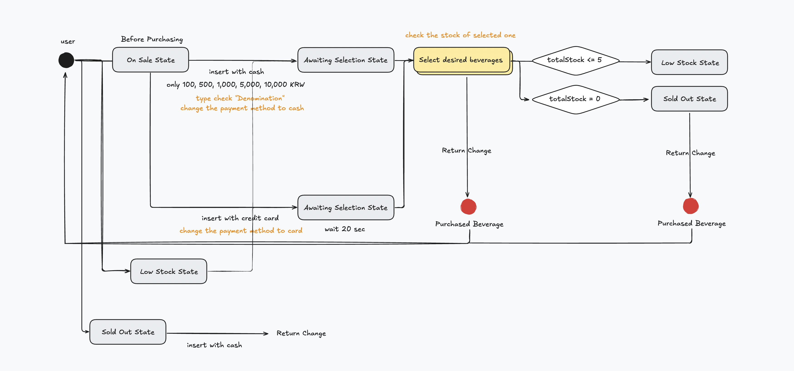
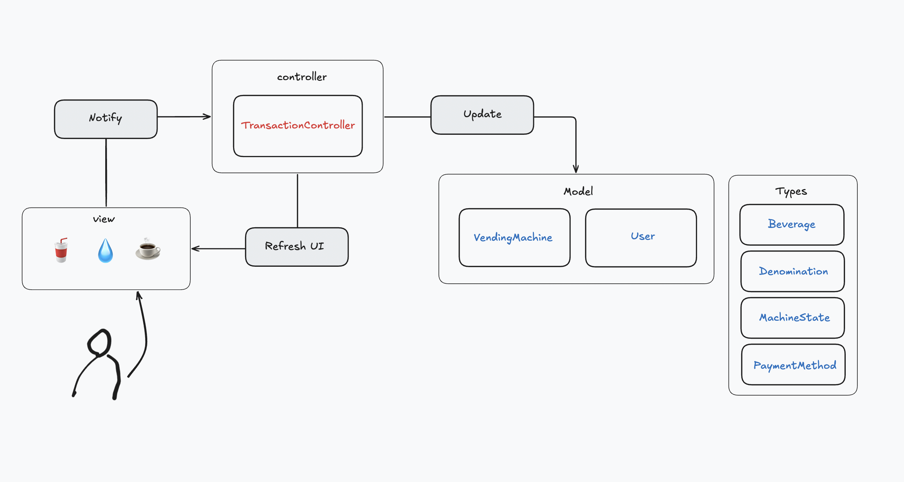

# Vending Machine

## Overview

This project outlines the mechanism of a vending machine, demonstrating its operation through a diagram and core logic implementation in TypeScript. The implementation includes handling various scenarios and exceptions, providing a seamless user experience.

## 

## Features

1. **Supported Payment Methods**:

   - **Cash**: Accepts 100, 500, 1,000, 5,000, and 10,000 KRW.
   - **Card**: Credit Card payment supported.

2. **Available Beverages**:

   - **Cola**: 1,100 KRW
   - **Water**: 600 KRW
   - **Coffee**: 700 KRW

3. **Scenarios and Exception Handling**:

   - **Change Calculation and Return**: Calculates the appropriate change to return to the user after a successful transaction and ensures the vending machine has sufficient change available.
   - **Insufficient Cash**: Not have enough cash to complete a transaction.
   - **Invalid Cash Denominations**: Rejects unsupported cash denominations and prompts the user to insert valid denominations.
   - **Negative Amount**: Handles errors where a negative cash amount is inserted.
   - **Beverage Not Found**: when the requested beverage is not found in the vending machine.
   - **Insufficient Cash For Beverage**: Handles errors when the user does not have enough cash to purchase a selected beverage.
   - **Out-of-Stock Beverages**: Notifies the user when the selected beverage is unavailable and allows them to choose another beverage or cancel the transaction.

---

## Deliverables

### 1. Process for purchasing desired beverage

A visual representation of the vending machine’s operation from user interaction to beverage dispensing. The diagram includes key decision points and processes such as payment validation, change calculation, and exception handling.



### 2. MVC Pattern Architecture

This diagram demonstrates an MVC (Model-View-Controller) pattern:

- **1. Model**: Represents the core data logic, including VendingMachine and User. These handle data storage, state management, and business logic.

- **2. View**: Handles the user interface, displaying beverages and user interactions. The UI functionality ensures the display updates whenever the Controller modifies the data.

- **3. Controller**: Manages communication between the View and Model, with TransactionController orchestrating actions like user interactions and updates. It notifies the View and updates the Model based on user inputs.



---

## Project Structure

```
src/
    ├── controller
    │ └── transaction.ts
    ├── exceptions
    │ ├── beverage
    │ │ ├── beverageNotFoundException.ts
    │ │ ├── insufficientCashForBeverageException.ts
    │ │ └── outOfStockBeverageException.ts
    │ ├── cash
    │ │ ├── insufficientCashException.ts
    │ │ ├── invalidDenominationException.ts
    │ │ └── negativeAmountException.ts
    │ ├── customBusinessException.ts
    │ └── index.ts
    ├── main.ts
    ├── models
    │ ├── beverage.ts
    │ ├── denomination.ts
    │ ├── machineState.ts
    │ ├── paymentMethod.ts
    │ ├── user.ts
    │ └── vendingMachine.ts
    ├── style
    │ └── index.css
    ├── test
    │ ├── controller
    │ │ └── transaction.spec.ts
    │ ├── user.spec.ts
    │ └── vendingMachine.spec.ts
    ├── ui
    │ ├── displayMessageUI.ts
    │ ├── index.ts
    │ ├── resetMessageUI.ts
    │ ├── updateBeveragesUI.ts
    │ ├── updateCashUI.ts
    │ ├── updatePaymentUI.ts
    │ ├── updatePurchaseHistoryUI.ts
    │ └── updateStateUI.ts
    └── vite-env.d.ts
```

---

## How to Run

1. **Prerequisites**:

   - Node.js installed on your system.

2. **Steps**:

   1. Clone the repository.
   2. Open the project in IDE.
   3. Install dependencies.
      ```bash
      npm install
      ```
   4. Start the development server.
      ```bash
      npm run dev
      ```
   5. Run tests.
      ```bash
      npm run test
        <!-- or -->
      npm run test:coverage
      ```

---

## Testing

- models
  - VendingMachine class.
  - User class.
- controller
  - transactionController

## Contact

For further queries, feel free to reach out at [howyoujini@gmail.com].
